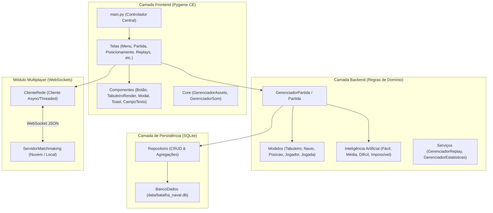

# Relatório Técnico Final: Sistema Batalha Naval

Este documento apresenta a análise técnica detalhada da arquitetura, organização modular, padrões de projeto e a especificação de cada arquivo, classe e função implementados no projeto **Batalha Naval**. O objetivo deste relatório é fornecer uma base sólida, clara e organizada para apresentação acadêmica e avaliação técnica do projeto.

---

## 1. Visão Geral e Arquitetura do Sistema

O sistema foi concebido sob os princípios de alta coesão e baixo acoplamento, adotando uma separação estrita entre a camada de lógica de negócios (`backend`), a camada de interface gráfica e interação com o usuário (`frontend`), o módulo de comunicação em rede (`backend/rede`) e a camada de persistência de dados (`backend/database`).

### Padrões de Projeto (Design Patterns) Utilizados

1. **Model-View-Controller (MVC) Adaptado**:
   - **Model**: `backend/models` e `backend/servicos`.
   - **View**: `frontend/componentes`, `frontend/animacoes` e métodos `desenhar()` das telas.
   - **Controller**: `main.py` e métodos `processar_evento()` / `atualizar()` das telas.
2. **Strategy Pattern** (`backend/ia`): Encapsula diferentes estratégias de tomada de decisão da IA (`IAFacil`, `IAMedia`, `IADificil`, `IAImpossivel`) sob a interface comum `IABase`.
3. **Factory Method** (`backend/ia/fabrica_ia.py`): Centraliza a criação dinâmica das instâncias de IA a partir do enum `DificuldadeIA`.
4. **Repository Pattern** (`backend/database`): Isola todo o acesso a dados e comandos SQL na classe `Repositorio`.
5. **Singleton Pattern** (`frontend/core`): Garante instância única e compartilhada para carregamento de recursos gráficos (`GerenciadorAssets`) e de áudio (`GerenciadorSom`).
6. **State Pattern & Navigation Stack** (`main.py` e `frontend/telas`): Controle de estado da aplicação através de telas intercambiáveis com histórico em pilha (`pilha_telas`).
7. **Virtual Canvas Proportional Scaling**: Toda a renderização gráfica é feita em um canvas virtual fixo de 1280x720, que é projetado e escalonado na janela real mantendo proporção (*letterboxing* automático), suportando qualquer resolução de tela ou modo de exibição.

---

## 2. Ponto de Entrada: `main.py`

Arquivo responsável por inicializar a engine gráfica Pygame, carregar as dependências globais, configurar a janela e orquestrar o loop principal de eventos, atualização física e renderização.

### Classe `JogoPrincipal`
- `__init__()`: Inicializa submódulos do Pygame (display, mixer, font), define o modo janela de 1280x720 por padrão, cria o canvas virtual, instancia o banco de dados/repositório e registra todas as telas da aplicação.
- `definir_fullscreen(fullscreen: bool)`: Alterna dinamicamente a janela entre o modo Janela (1280x720) e Tela Cheia sem reiniciar o jogo.
- `definir_resolucao(resolucao: tuple[int, int])`: Ajusta as dimensões da janela de exibição mantendo a proporção virtual interna.
- `definir_jogador_ativo(id_jogador: int, nome: str)`: Atualiza o identificador e o nome do perfil de jogador ativo para as partidas e estatísticas.
- `mudar_tela(nome_tela: str, registrar_historico: bool, **kwargs)`: Transiciona para uma nova tela, salvando a tela anterior na pilha de histórico para permitir retorno hierárquico.
- `voltar_tela(**kwargs)`: Desempilha a tela anterior da pilha e retorna a ela com segurança.
- `iniciar_partida_vs_ia(dificuldade: DificuldadeIA)`: Configura os objetos `JogadorHumano` e `JogadorComputador`, instancia a `Partida` e navega para a tela de posicionamento.
- `iniciar_partida_pvp_local()`: Configura dois jogadores humanos locais e inicia o fluxo de preparação de frota.
- `iniciar_partida_cxc(dif1: DificuldadeIA, dif2: DificuldadeIA)`: Configura dois jogadores controlados por IA para simulação automática com visualização assistida.
- `iniciar_partida_multiplayer(cliente_rede: ClienteRede, eu_sou_jogador1: bool, tabuleiro_customizado: Tabuleiro)`: Inicia a partida online sincronizada via rede utilizando os dados recebidos do servidor WebSocket.
- `executar()`: Executa o loop principal (`while self.rodando`) que captura eventos de entrada (`pygame.event.get()`), atualiza a lógica da tela ativa (`atualizar(dt)`), desenha o frame no canvas virtual e o projeta na tela com redimensionamento proporcional via `pygame.transform.smoothscale`.

---

## 3. Detalhamento do Pacote `backend`

### 3.1. `backend/constantes.py`
Centraliza os enums e valores constantes que definem as regras e dimensões do jogo:
- `TAMANHO_TABULEIRO = 10`: Dimensão padrão da grade (10x10).
- `LETRAS_COLUNAS` e `NUMEROS_LINHAS`: Mapeamento das colunas (A a J) e linhas (1 a 10).
- `TipoNavio (Enum)`: Define os tipos de embarcação permitidos:
  - `PEQUENO`: Ocupa 2 células.
  - `GRANDE`: Ocupa 4 células.
- `FROTA_PADRAO`: Tupla contendo a composição oficial da frota (2 navios Grandes e 4 navios Pequenos, totalizando 6 embarcações e 16 células).
- `Orientacao (Enum)`: `HORIZONTAL` e `VERTICAL`.
- `EstadoCelula (Enum)`: `VAZIO`, `NAVIO`, `AGUA`, `ACERTO`, `AFUNDADO`.
- `ResultadoTiro (Enum)`: `AGUA`, `ACERTO`, `AFUNDADO`.
- `ModoJogo (Enum)`: `JOGADOR_VS_COMPUTADOR`, `JOGADOR_VS_JOGADOR_LOCAL`, `COMPUTADOR_VS_COMPUTADOR`, `JOGADOR_VS_JOGADOR_REDE`.
- `DificuldadeIA (Enum)`: `FACIL`, `MEDIA`, `DIFICIL`, `IMPOSSIVEL`.
- `EstadoPartida (Enum)`: `POSICIONAMENTO`, `EM_ANDAMENTO`, `FINALIZADA`, `PAUSADA`.

### 3.2. `backend/excecoes.py`
Hierarquia de exceções customizadas para tratamento semântico de erros de domínio:
- `BatalhaNavalErro`: Exceção base de todo o domínio.
- `PosicaoInvalidaErro`: Coordenada fora do tabuleiro ou formato alfanumérico inválido.
- `NavioSobrepostoErro`: Tentativa de posicionar um navio colidindo com outro existente.
- `NavioForaDoTabuleiroErro`: Tentativa de posicionar navio cujas dimensões extrapolam o limite da grade.
- `JogadaRepetidaErro`: Tentativa de disparar em uma coordenada já alvejada.
- `PartidaFinalizadaErro`: Tentativa de realizar jogadas em uma partida já encerrada.
- `FrotaIncompletaErro`: Tentativa de iniciar partida sem que todos os navios estejam posicionados.

### 3.3. `backend/models/posicao.py`
- **Classe `Posicao` (dataclass imutável `frozen=True`, `order=True`)**:
  - Atributos: `linha: int`, `coluna: int` (índices de 0 a 9).
  - `e_valida()`: Valida se a linha e a coluna estão no intervalo `[0, 9]`.
  - `para_coordenada()`: Converte os índices numéricos para formato alfanumérico clássico (ex: `linha=0, coluna=2` $\rightarrow$ `"C1"`).
  - `de_coordenada(coordenada: str)`: Método de fábrica que processa uma string (ex: `"A5"`, `"j10"`) via Expressão Regular e instancia o objeto `Posicao`.
  - `criar_segura(linha: int, coluna: int)`: Cria uma `Posicao` se válida, ou retorna `None` em caso de extrapolação de limites sem disparar exceção.
  - `obter_vizinhas_ortogonais()`: Retorna a lista de posições adjacentes válidas (Norte, Sul, Leste, Oeste).

### 3.4. `backend/models/navio.py`
- **Classe `Navio`**:
  - Atributos: `tipo: TipoNavio`, `posicao_inicial: Posicao`, `orientacao: Orientacao`, `sprite_id: int | None`, `posicoes: list[Posicao]`, `posicoes_atingidas: set[Posicao]`.
  - `_calcular_posicoes()`: Calcula o conjunto de coordenadas ocupadas pelo navio a partir da posição inicial, tamanho e orientação.
  - `contem_posicao(posicao: Posicao)`: Verifica se uma dada posição pertence ao navio.
  - `atingir(posicao: Posicao)`: Registra um impacto na posição especificada.
  - `esta_afundado()`: Retorna `True` quando todas as posições do navio foram atingidas.
  - `sobrepoe(outro: Navio)`: Verifica intersecção de células entre dois navios.
  - `para_dict()` / `de_dict()`: Métodos de serialização e desserialização JSON para replays e banco de dados.

### 3.5. `backend/models/jogada.py`
- **Classe `Jogada`**:
  - Registra os dados de um disparo executado: número do turno, nome do jogador atacante, coordenada `Posicao`, resultado (`ResultadoTiro`), tipo de navio atingido (se houver), booleano se o navio afundou e carimbo de tempo (`timestamp`).
  - `para_dict()` / `de_dict()`: Serialização para histórico e replay.

### 3.6. `backend/models/tabuleiro.py`
- **Classe `Tabuleiro`**:
  - Atributos: `tamanho: int` (10), `navios: list[Navio]`, `tiros_recebidos: set[Posicao]`, `grade: list[list[EstadoCelula]]`.
  - `limpar()`: Restaura o tabuleiro para o estado inicial vazio.
  - `obter_celula(linha, coluna)`: Retorna o estado da célula na matriz.
  - `obter_navio_na_posicao(posicao)`: Localiza a embarcação presente em uma coordenada.
  - `pode_posicionar(tipo, posicao_inicial, orientacao, ignorar_navio)`: Valida se um navio cabe na grade sem colidir com outros.
  - `adicionar_navio(navio)`: Insere o navio e atualiza o estado das células na grade.
  - `remover_navio(navio)`: Remove um navio previamente colocado.
  - `posicionar_automaticamente(frota, seed)`: Posiciona aleatoriamente todas as embarcações de forma válida.
  - `posicionar_estrategicamente(frota, seed)`: Posicionamento tático avançado que dispersa os navios grandes nas extremidades e mantém espaçamento para dificultar a busca por IA.
  - `processar_tiro(posicao)`: Processa o disparo recebido, atualiza a célula para `AGUA`, `ACERTO` ou `AFUNDADO`, e retorna `(ResultadoTiro, Navio | None)`. Rejeita tiros repetidos com `JogadaRepetidaErro`.
  - `todos_navios_afundados()`: Retorna `True` quando a frota inteira foi destruída.
  - `navios_restantes()`: Lista as embarcações ainda vivas.
  - `posicoes_nao_atacadas()`: Lista de coordenadas virgens ainda não alvejadas.
  - `obter_matriz_visivel()`: Retorna uma representação matricial segura para o adversário (ocultando navios não atingidos).

### 3.7. `backend/models/jogador.py`
- **Classe Base `Jogador` (Abstrata)**:
  - Mantém o nome, ID, tabuleiro próprio, total de tiros, total de acertos, maior sequência consecutiva de acertos e taxa percentual de aproveitamento (`aproveitamento`).
- **Classe `JogadorHumano`**: Representa um jogador humano com controle via mouse/teclado.
- **Classe `JogadorComputador`**: Representa a IA; encapsula um objeto `IABase` e invoca `escolher_jogada(tabuleiro_adversario)` de forma autônoma.
- **Classe `JogadorRemoto`**: Representa o adversário conectado remotamente via WebSocket.

### 3.8. Pacote `backend/ia` (Inteligência Artificial)
- `ia_base.py` (`IABase`): Interface abstrata com os métodos `escolher_jogada(tabuleiro)`, `registrar_resultado(posicao, resultado, navio_afundado)` e `reiniciar()`.
- `ia_facil.py` (`IAFacil`): Escolhe coordenadas puramente aleatórias entre as células ainda não atacadas, sem estratégia de perseguição.
- `ia_media.py` (`IAMedia`):
  - Implementa a técnica clássica de **Caça e Alvo** (*Hunt and Target*).
  - Na fase de Caça, realiza varredura exploratória distribuída pelas águas abertas do tabuleiro.
  - Ao acertar um navio, ativa o modo Alvo: enfileira e persegue ortogonalmente todas as células vizinhas até a destruição total da embarcação.
- `ia_dificil.py` (`IADificil`):
  - Implementa **Amostragem Monte Carlo / Mapa de Densidade de Probabilidade (PDF)** combinada com **Poda de Espaços Mortos (*Dead-Space Pruning*)** e **Paridade Ótima**.
  - Simula dinamicamente todas as combinações válidas de posicionamento conjunto dos navios remanescentes da frota, podando automaticamente qualquer região ou ilha de células onde nenhuma embarcação restante cabe.
  - Na fase de caça, prioriza a paridade do menor navio vivo; quando há acertos ativos não afundados, aplica peso exponencial sobre as retas e eixos dos acertos, alcançando média de ~50 tiros por vitória.
- `ia_impossivel.py` (`IAImpossivel - Marechal Anthony`):
  - IA onisciente de precisão cirúrgica (100% de acerto).
  - Possui o método exclusivo `reposicionar_frota_propria(tabuleiro)` que move seus próprios navios não danificados para novas posições seguras no tabuleiro a cada turno, simulando manobras táticas contínuas.
- `fabrica_ia.py` (`FabricaIA`): Factory method que recebe `DificuldadeIA` e instancia a classe correspondente.

### 3.9. Pacote `backend/database` (Persistência SQLite)
- `banco_dados.py` (`BancoDados`):
  - Gerencia o arquivo SQLite em `data/batalha_naval.db`.
  - `_criar_tabelas()`: Cria automaticamente as tabelas relacionais `jogadores`, `estatisticas`, `partidas` e `replays` com chaves estrangeiras e índices.
- `repositorio.py` (`Repositorio`):
  - `obter_ou_criar_jogador(nome)`: Recupera o perfil ou cadastra um novo com inicialização de estatísticas zeradas.
  - `salvar_partida_e_replay(...)`: Registra a partida concluída, atualiza estatísticas agregadas (vitórias, derrotas, acertos, erros, sequências) e persiste o replay completo em JSON.
  - `obter_estatisticas_jogador(jogador_id)`: Consulta as estatísticas detalhadas consolidadas.
  - `listar_replays(jogador_id)` / `obter_replay(replay_id)` / `excluir_replay(replay_id)`: Operações de consulta e manutenção dos replays salvos.
  - `resetar_banco_dados()`: Limpa com segurança todos os dados e histórico.

### 3.10. Pacote `backend/servicos` (Orquestração de Regras)
- `gerenciador_partida.py` (`Partida`):
  - Controlador central da partida.
  - `iniciar_partida(primeiro_jogador)`: Valida as frotas de ambos os jogadores, inicia o cronômetro e define o primeiro a jogar.
  - `executar_jogada(posicao, atacante)`: Executa o disparo no tabuleiro defensor, registra no histórico, atualiza sequências do atacante, notifica a IA e alterna o turno caso a partida continue.
  - `pausar()` / `despausar()`: Controla a contagem de tempo sem contabilizar pausas.
  - `_finalizar_partida(vencedor)`: Encerra a partida e aciona a persistência no repositório.
- `gerenciador_estatisticas.py` (`GerenciadorEstatisticas`):
  - Formata e calcula índices de desempenho para exibição na UI (taxa de vitórias %, precisão %, média de tiros por vitória).
- `gerenciador_replay.py` (`GerenciadorReplay`):
  - Máquina de estados para reprodução interativa de gravações. Permite avançar passo a passo (`avancar_passo()`), retroceder (`voltar_passo()`), reprodução contínua (`play/pause`) e ajuste de velocidade (1x, 2x, 4x).

### 3.11. Pacote `backend/rede` (Multiplayer Online WebSocket)
- `protocolo.py`: Define o enum `TipoMensagem` (`ENTRAR_FILA`, `PARTIDA_ENCONTRADA`, `ACEITAR_PARTIDA`, `PARTIDA_INICIADA`, `ENVIAR_FROTA`, `FROTAS_CONFIRMADAS`, `REALIZAR_JOGADA`, `JOGADA_RECEBIDA`, `DESCONEXAO`, etc.) e funções de serialização/deserialização JSON.
- `servidor_matchmaking.py` (`ServidorMatchmaking`):
  - Servidor WebSocket assíncrono baseado em `asyncio` e `websockets`.
  - Gerencia conexões ativas, fila de espera de pareamento (*matchmaking queue*), envio de convite de partida com contagem regressiva de 10 segundos, coleta e troca segura de frotas preparadas por cada jogador, e repasse bidirecional de jogadas.
- `cliente_rede.py` (`ClienteRede`):
  - Cliente WebSocket executado em thread desacoplada em background (`threading.Thread`) com loop `asyncio` próprio.
  - Utiliza uma fila segura (`queue.Queue`) para enviar eventos recebidos da rede diretamente para a thread principal do Pygame sem travamentos de UI.

---

## 4. Detalhamento do Pacote `frontend`

### 4.1. `frontend/core`
- `constantes.py`: Define a paleta de cores moderna náutica (cores de painéis, realces cyan/ouro/esmeralda, cores do grid), resolução base (1280x720) e framerate (60 FPS).
- `gerenciador_assets.py` (`GerenciadorAssets`): Singleton que carrega, redimensiona e armazena em cache fontes TrueType (`DejaVuSans`, `FreeSans`) e sprites náuticos (`assets/sprites/PNG`).
- `gerenciador_som.py` (`GerenciadorSom`): Singleton de áudio com canais independentes para trilha sonora (`pygame.mixer.music`) e efeitos sonoros (`assets/sons/canhoes`, `assets/sons/navios`, `assets/sons/ui`), permitindo controle granular de volume.

### 4.2. `frontend/animacoes`
- `animacao_tiro.py` (`AnimacaoTiro`): Calcula a trajetória parabólica de um projétil de canhão em arco balístico entre o tabuleiro do atacante e a célula alvejada no defensor, com cálculo de sombra e escala em profundidade.
- `particulas.py` (`SistemaParticulas`, `Particula`): Emissor de partículas leves para efeitos visuais de fumaça de canhão, borrifos de água (splash) e explosões flamejantes de impacto.

### 4.3. `frontend/componentes`
- `botao.py` (`Botao`): Botão estilizado com detecção de hover, clique, animação de clique, bordas arredondadas e cores configuráveis.
- `campo_texto.py` (`CampoTexto`): Caixa de entrada de texto interativa com suporte a cursor piscante, seleção, backspace, atalhos de área de transferência (`Ctrl+V` para colar, `Ctrl+A` para limpar) e ajuste automático de tamanho de fonte para evitar estouro de texto.
- `modal.py` (`Modal`): Janela de diálogo flutuante modal com escurecimento de fundo (*backdrop dimming*), botões de confirmação/cancelamento e temporizador opcional.
- `toast.py` (`Toast`): Notificação visual temporizada exibida na base da tela para feedback rápido ao usuário.
- `tabuleiro_render.py` (`TabuleiroRender`): Renderizador visual de tabuleiro 10x10. Converte coordenadas de tela (pixels) em coordenadas matriciais da grade, desenha navios texturizados com rotação correta, exibe marcadores de tiro (água, acerto, afundado) e gera realces de hover e seleção.
- `painel_historico.py` (`PainelHistorico`): Painel lateral com lista rolável das últimas jogadas da batalha com badges coloridos de resultado.

### 4.4. `frontend/telas` (Telas do Jogo)
- `tela_base.py` (`TelaBase`): Classe base abstrata definindo os métodos do ciclo de vida: `inicializar(**kwargs)`, `processar_evento(evento)`, `atualizar(dt)` e `desenhar(superficie)`.
- `tela_splash_nome.py` (`TelaSplashNome`): Tela inicial de boas-vindas com captura e seleção de perfil do jogador.
- `tela_menu.py` (`TelaMenu`): Menu principal interativo com navegação para todos os modos e recursos.
- `tela_opcoes.py` (`TelaOpcoes`): Menu de configurações com alternância de modo janela/tela cheia, resolução de tela, sliders de áudio (Master, Música, Efeitos, UI) e botão de limpeza de dados da conta.
- `tela_selecao_modo.py` (`TelaSelecaoModo`): Permite selecionar entre Jogador vs Máquina, Jogador vs Jogador e Simulação Máquina vs Máquina.
- `tela_selecao_dificuldade.py` (`TelaSelecaoDificuldade`): Escolha de IA com cartões descritivos das estratégias táticas de cada nível.
- `tela_selecao_pvp.py` (`TelaSelecaoPvP`): Seleção entre PvP Local e Multiplayer Online com tutoriais visuais e alertas explicativos.
- `tela_posicionamento.py` (`TelaPosicionamento`): Interface tática para posicionamento manual da frota (clique com botão esquerdo para posicionar, tecla 'R' ou botão direito para girar), posicionamento randômico automático, validação em tempo real e sincronização de frota multiplayer.
- `tela_partida.py` (`TelaPartida`): Tela principal da batalha. Apresenta tabuleiros duplos (frota própria e radar inimigo), HUD com cronômetro isolado, indicador do turno ativo, animações de disparos e partículas, painel de histórico lateral e modal de encerramento.
- `tela_estatisticas.py` (`TelaEstatisticas`): Dashboard com indicadores consolidados do jogador (vitórias, derrotas, aproveitamento %, maior sequência e recorde de jogadas).
- `tela_replays.py` (`TelaReplays`): Visualizador e gerenciador de replays gravados com duplo tabuleiro interativo e controles de reprodução (play, pause, step forward/backward, velocidade e exclusão).
- `tela_creditos.py` (`TelaCreditos`): Tela de créditos e atribuições das licenças dos assets visuais e sonoros (Kenney, HorrorPen, Vircon32).
- `tela_multiplayer.py` (`TelaMultiplayer`): Tela de conexão online com URL padrão pré-configurada, indicador de status dinâmico (*"Acordando servidor na nuvem..."* / *"Procurando adversário..."*), popup de aceite com contagem regressiva e aviso de inicialização do plano gratuito do Render.

---

## 5. Resumo das Regras de Negócio e Validações

| Regra de Negócio | Implementação e Arquivo | Comportamento no Sistema |
| :--- | :--- | :--- |
| **RN01** (Coordenadas A1-J10) | `backend/models/posicao.py` | Aceita coordenadas matriciais ou alfanuméricas de A1 a J10 com regex e validação de limites. |
| **RN02** (Jogadas Repetidas) | `backend/models/tabuleiro.py` | Lança `JogadaRepetidaErro`; disparo repetido não consome o turno do jogador e emite aviso na UI. |
| **RN03** (Condição de Afundamento) | `backend/models/navio.py` | Embarcação é considerada afundada se e somente se 100% de suas células foram alvejadas. |
| **RN04** (Condição de Vitória) | `backend/servicos/gerenciador_partida.py` | A partida encerra imediatamente no momento em que o último navio da frota de um jogador é destruído. |
| **RN05** (Autonomia da IA) | `backend/ia/*.py` | As IAs operam estritamente sobre a matriz visível do adversário, sem trapaça (exceto no nível extremo onisciente). |

---

## 6. Conclusão

A arquitetura desenvolvida atende rigorosamente a todos os requisitos funcionais, não funcionais e regras de negócio estipulados. O código fonte está padronizado, completamente tipado, estruturado sem dependências circulares e otimizado para execução estável e fluida.
